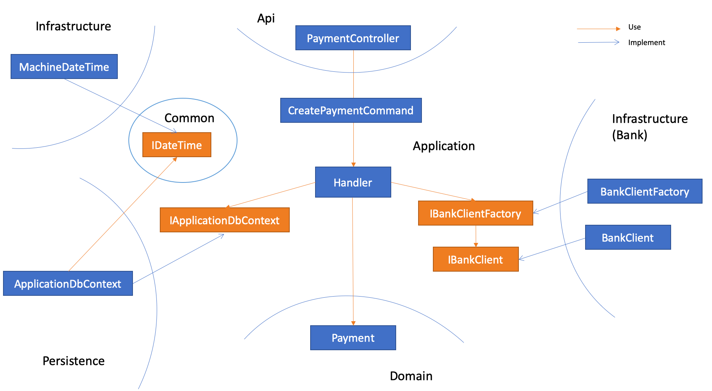

# How to run Payment Gateway

### Payment Gateway Set-up
The target framework is netcoreapp3.0. To run the solution,  download and install .NET Core SDK v3.0.0 or later at https://dotnet.microsoft.com/download/dotnet-core/3.0

PowerShell is required to run a build script which compiles the solution, migrate the database, and run tests.

1. Clone or download the solution.
2. Open a PowerShell with admin privilege. Go to the solution root folder and execute `./build.ps1`. This complies the solution, migrates database and run tests.
4. Open a terminal (or command) window and change directory to Api root folder. Execute `dotnet run` command.
5. Change directory to IdentityServer and execute `dotnet run` command.
5. Visit https://localhost:5001.

[todo] install psake..  --> create build project

Note: If run into a permission error like "Can't write to SQLite ...", make sure the terminal is run as Admin privilege.

### Give it a go
Use sample request 

# Dependency rules in the architecture
The model of the solution is based on Clean Architecture and CQRS. 
The concentric circles in [Figure 1] represent different areas of software. The inner circles are policies; the outer circles are mechanism. The further in you go, the higher level the software becomes, in general.

[Figure 1]

*Source code dependencies must point only inward, toward higher-level policies.*

By separating the software into layers and conforming to the dependency rules, a system becomes intrinsically testable.

- Domain contains entities, value objects, enterprise-wide logic and exceptions
- Application contains interfaces to implement use case scenarios, command / queries, validators, exceptions
- Infrastructure contains all external concerns
- Presentation and Infrastructure depend only on Application
- Infrastructure and Presentation components can be replaced with minimal effort

# Application layer and  CQRS
Application layer is for use case scenarios to be implemented. The CQRS structure in [Figure 2] shows clear messages of the application purpose. 

[Figure 2] - CQRS Folder Structure

Having interfaces declared in Application conforms to the inversion of control. It makes it easy to replace external resource (dependency). [Figure 3] shows an example of creating a payment. 

[Figure 3]

Handler acquires a bank client through a bank client factory to send a payment request to a bank. If it is successful, it saves the payment details using the application-db-context.
Note that Handler works with interfaces. 

Looking at arrows indicating the use of interfaces, nothing in Application knows anything about something in an outside world except Domain.

# Solution Architecture

[Figure 4]

| Project        | Description           | Project Dependencies |
| ------------- |-------------|-------------|
| ApiClient     | A test tool to demonstrate how to get a bearer token form IdentityServer and use it to call API | - |
| Api     | Payment gateway API      | Application, Bank, Common, Infrastructure, Persistence |
| Infrastructure | Has MachineDateTime implementation of IDateTime from Common project     | Application, Common |
| Bank | Collection of bank clients. Bank simulator mocks a bank for the sake of test | Application |
| DbMigration | Control database schema explicitly / Run by a build script | - |
| IdentityServer | Issue a bearer token to secure API | - |
| Persistence | Operate CRUD on database | Application |
| Application | Wrap up Domain to keep it isolated / Source of interfaces | Common, Domain |
| Domain | Entity, value object, exception defined at enterprise level | Common |
| Common | Cross cutting concerns like date time service, logging, etc | - |

